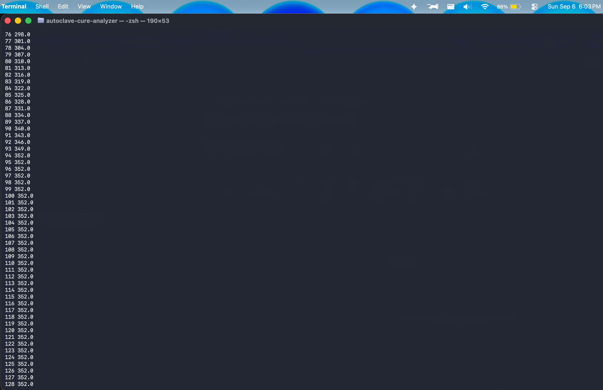
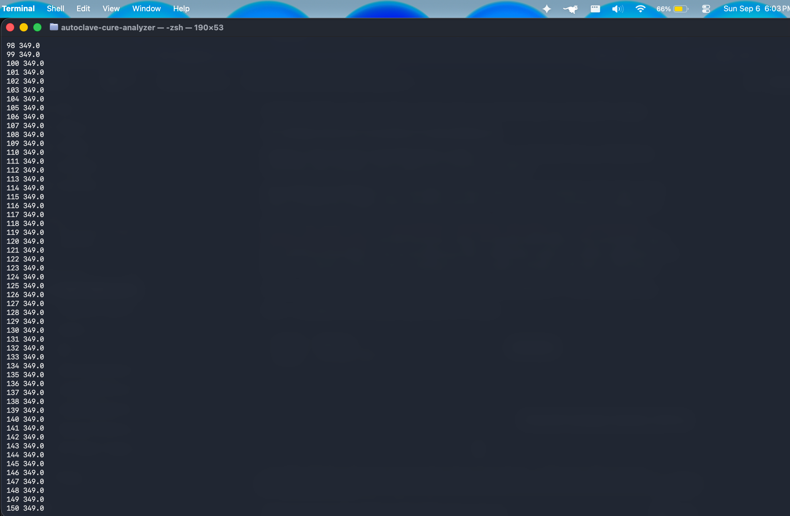
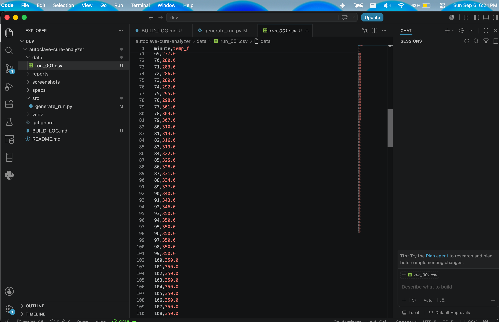
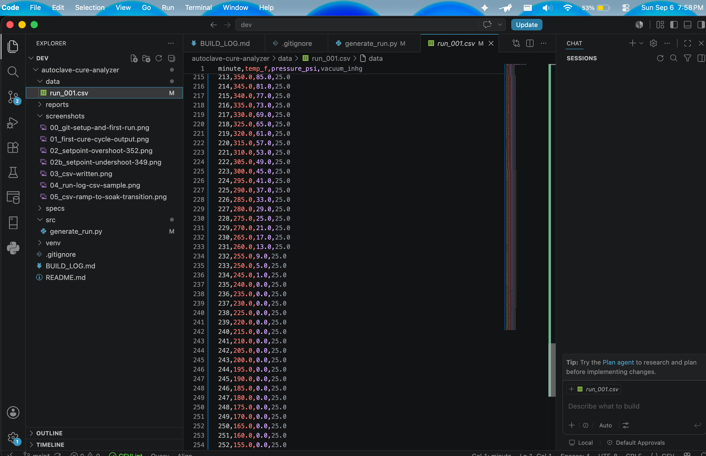
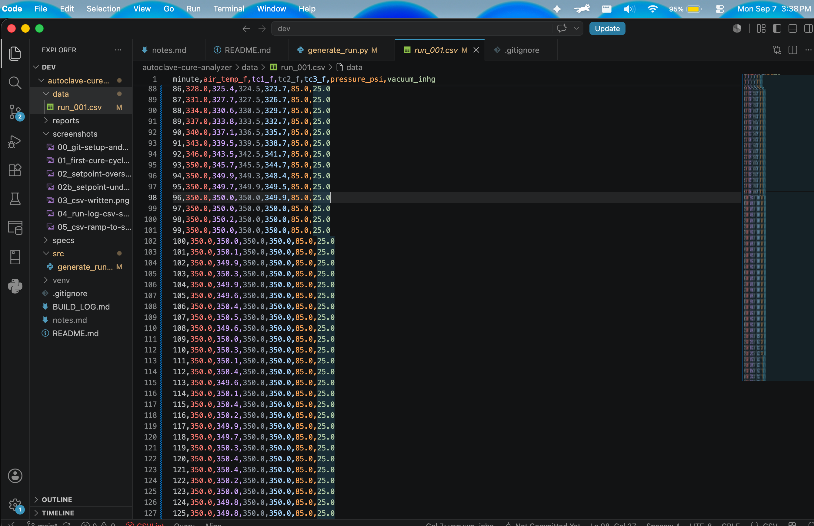
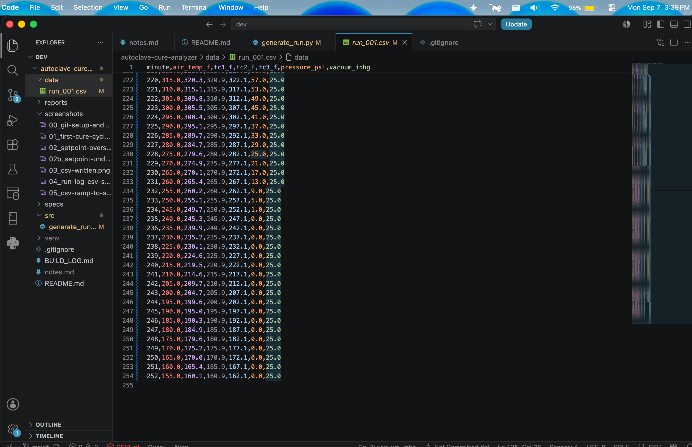

# Build Log

Decisions I made while building this, and why. Written as I go, so the reasoning is recorded rather than reconstructed later.

Every entry here is something a reader could reasonably disagree with. That's the point of writing them down.

---

## Sampling interval: one reading per minute

Real autoclave controllers sample faster, often every few seconds. At one reading per second, a six-hour run is over 21,000 rows — impossible to eyeball while developing.

One per minute gives around 250 rows for a four-hour run: realistic in shape, small enough to read. The detection logic works from timestamps, so the interval isn't baked into it and can change later without touching the rules.

## The setpoint problem

The spec says soak at 350°F. My first generator held the soak at 352.

The ramp loop ran `while temperature < SOAK_TEMP`. At minute 93 the temperature was 349. Is 349 below 350? Yes — so the loop ran once more, added 3°F, landed on 352, and then stopped. Every "good" run I generated was already 2°F above spec.

Nothing errored. Nothing looked wrong on screen. The number was just wrong.



Second attempt, check ahead before stepping:

```python
while temperature + RAMP_RATE <= SOAK_TEMP:
```

Now it held at 349. Undershooting by 1 instead of overshooting by 2.



**Why neither worked.** 350 − 70 = 280 degrees to climb. At 3°F per minute that's 93.33 minutes. There is no minute at which a 3-degree step lands exactly on 350. The step size doesn't divide evenly into the range, so any loop must stop short or overshoot. No loop condition fixes that.

**What I settled on** — keep the look-ahead condition, then snap to the setpoint before the soak begins:

```python
air = p["soak_temp"]
```

Not because it's simpler, but because it's what the equipment does. A real controller doesn't march in blind fixed steps and hold wherever it lands. It ramps toward a setpoint and holds at the setpoint.

The generator should model the machine, not my loop.

### A consequence worth recording

The snap makes the final ramp step 4°F instead of 3°F. Acceptable while the spec's maximum ramp rate is 5°F/min. But if I ever set a maximum below 4, my own generator would produce a "good" run that my own detector flags as a violation — a false positive built into the test data rather than into the detection logic.

The generator and the spec are coupled at this point. When accuracy numbers look wrong later, check upstream before assuming the detector is at fault.



## Pressure: gradual vent, not an instant drop

Pressure holds at 85 psi through ramp and soak, then vents during cool-down.

My first instinct was an instant drop to zero. I chose a gradual vent at 4 psi per minute instead, for a reason that isn't about realism.

An instant drop is a cliff edge in the data. Every rule I write about pressure becomes trivially easy to satisfy, because the transition is unmistakable. A gradual vent creates a genuine question: when does the cure actually end? Pressure is falling, temperature is falling, and there's a window where "still curing" and "cooling down" overlap. Stage detection has to make a judgment call there.

That ambiguity is the interesting part of the problem. Clean transitions prove nothing.

There's a practical reason too. When I inject a pressure-sag fault, the detector has to distinguish pressure dropping because we're venting normally from pressure dropping because something failed. With an instant vent that distinction doesn't exist. With a gradual vent, the detector has to use stage context to decide.

Which is why stage detection comes before deviation detection in the pipeline.

## Clamping pressure at zero

```python
pressure = max(0.0, pressure - VENT_RATE_PSI)
```

85 psi at 4 psi/min reaches zero after 22 minutes, but cool-down runs 40. Without a floor, the last rows would read about −72 psi — physically meaningless, and it would have quietly poisoned any pressure rule written against it.

`max()` enforces the floor in one line rather than an if-statement.



## Three thermocouples with thermal lag

Real parts have several probes and they don't agree. The controller reads one of them, but the edge of a part isn't the middle, and the difference between probes is itself a quality signal.

I modelled three: one following the air closely with sensor noise, and two with thermal lag at 85% and 70% response.

```python
probes[name] += (air - probes[name]) * response
```

Read as: take the gap between the air and where the probe currently is, close 85% of it. The probe is always heading toward the air temperature and never quite catching up.

The part I like about this formula is that cool-down needs no special case. On the way up the gap is positive, so the probe climbs behind the air. On the way down the gap is negative, so the probe falls, but stays above the air.

It's a pie out of the oven. The crust cools fast; the filling holds its heat long after the outside feels safe to touch. Thermal mass works in both directions.

I didn't write that behaviour. It fell out of the same line of code.





## Fault injection: at generation, mostly

Two ways to produce a broken run: modify a finished one, or build it wrong from the start.

Parameter faults are built wrong from the start. A slow ramp doesn't just change values — it changes how long the run is. At 1.5°F/min instead of 3, the ramp takes 181 minutes instead of 91, and every timestamp after it shifts. You can't patch that into a finished file without rebuilding the whole timeline.

Point-in-time faults are different. A vacuum leak changes one column and leaves the timeline untouched, so those are applied to the finished rows. I originally wanted one mechanism for everything, but forcing a vacuum decay into the generation loop meant threading a fault parameter through code that has nothing to do with vacuum. Two mechanisms, each doing the thing it's suited to, turned out cleaner than one mechanism doing both awkwardly.

**Choosing the fault values.** The temptation is to make faults obvious. A soak 25°F below setpoint against a ±10°F tolerance would be caught by any detector on the first reading, which tests nothing.

I set cold soak at 15°F low instead: 5 degrees outside tolerance, close enough that a noisy probe reading could sit near the boundary. The faults worth building are the ones that make the detector work.

**A bug worth recording.** Converting the script into a function silently dropped the cool-down loop — it ended up after `return`, so it never ran. The program reported success and wrote 214 readings instead of 253. Nothing errored.

That's the third time this class of failure has appeared in this project.

## Specification in JSON, not in code

Different parts cure to different specs. If the thresholds live in the code, then changing the part means editing the program.

The spec is input, not logic. It also means the parameters are visible and arguable rather than buried, which matters, because they're my judgment, not anyone's actual process specification.

The loader validates. A spec missing its ramp section, or with a minimum rate above its maximum, is rejected with a message naming the problem. The alternative is a rule comparing against `None` and quietly reporting every run as conforming — which is the same failure mode as the 352°F soak, arriving through a different door.

---

# Detection stages

## Soak is held until the part arrives, not until the air does

The generator originally held the soak for 120 minutes of air time. Then I built the detector and ran it against a nominal run, and the run failed.

The probes lag the air. At 70% response the slowest probe is still climbing when the air reaches 350, and it doesn't arrive until several minutes later. Crediting soak time from the moment the air arrives gives the part credit for time it didn't spend at temperature.

The generator now holds the soak until the slowest probe has been at temperature for the required duration, and the detector credits time the same way. A nominal run holds the air for 124 readings to give the part its 120 minutes.

This is the same point the thermal lag section makes, arriving with consequences. It's also why soak time is specified as a minimum rather than a target.

**How much does it matter?** At 70% probe response and a ±10°F tolerance, only a minute or two. The probe is inside the tolerance band almost immediately even though it hasn't reached the setpoint. The effect becomes significant when a probe is slow: the `probe_lag` run at 15% response takes 260 minutes against a nominal 253, because the controller waits for the laggard.

So the physics is real but the tolerance band absorbs most of it. Worth knowing before concluding that a small number means a small effect.

## Stage detection reads the data, not the spec

My first stage detection defined the soak as the readings where air temperature sat inside the specified band. That is the obvious reading of "find the soak," and it works on every run that reaches temperature.

Then I ran it against the cold soak fault, which holds at 335°F against a 350°F setpoint with ±10°F tolerance. The air never enters the band. No soak stage is detected. The entire run — ramp, plateau, and cool-down — collapses into one long "ramp".

The detector then reported three deviations. One was real: the soak was never reached. The other two were artefacts. Cool-down inside the ramp stage makes the ramp rate go negative, so `RAMP_RATE_LOW` fired. Pressure venting inside the ramp stage falls below the minimum, so `PRESSURE_LOW` fired.

One injected fault, three findings, two of them describing a problem that didn't exist.

**The fix** is to segment from the data. The soak is now the longest stretch the run held near its own maximum, whatever that maximum was. A cold soak has a plateau at 335, the detector finds it, and the rules then compare that plateau against the spec and report exactly one thing: the part didn't reach temperature.

Detection describes what happened. Rules decide whether it was acceptable. Keeping those separate is what stops one fault from manufacturing others.

I'd written "stage detection comes before deviation detection" in the pressure entry above without fully understanding why. This is why.

## How long a deviation must persist: answered with a measurement

This was an open question. I wrote at the time that I'd have a number once I could measure it against known injected faults, not before.

The accuracy harness made that possible. It regenerates the labelled set at increasing sensor noise and scores each persistence threshold against ground truth:

```
  noise    persistence=1   persistence=3   persistence=5
     1x     0 fp, 100%      0 fp, 100%      0 fp, 100%
     2x     0 fp, 100%      0 fp, 100%      0 fp, 100%
     3x     5 fp, 100%      1 fp, 100%      1 fp, 100%
     4x    21 fp, 100%      7 fp, 100%      7 fp, 100%
```

At nominal noise, persistence does nothing. The five-minute rate window already absorbs single-reading excursions, so there is nothing left for persistence to catch. My first sweep was flat across every value from 1 to 10, which told me the harness wasn't testing what I thought it was.

At three times nominal noise the threshold starts earning its place: persistence of 1 produces five false positives, persistence of 3 produces one. At four times, 21 against 7. Detection stays at 100% throughout, so the false positives are bought down at no cost.

Persistence of 5 is no better than 3 at any noise level tested. So the spec uses **3**, and the reason is in this table rather than in my judgment.

**What this doesn't tell me.** Every fault here is one I injected. A real log contains conditions I haven't thought to generate, and the noise model is Gaussian because that was easy, not because I measured real thermocouple behaviour. 100% detection against my own faults is the easier test and I should say so.

## Metrics scoped the way the rules are scoped

The summary reported "pressure fell no lower than 0.0 psi during ramp and soak." The finding directly below it said pressure held between 81.0 and 85.0 psi and passed.

Both came from the same analysis. The metric was computed across the whole run, which includes the vent to zero during cool-down. The rule was computed across ramp and soak only. Neither was wrong; they were answering different questions while appearing to answer the same one.

A reader would trust the summary less after seeing that, and rightly. Metrics are now scoped to the stages their corresponding rule evaluates.

This is a smaller version of the same problem the verifier exists to solve: output that isn't false, but is misleading, and nothing in the program can tell.

## A test that was wrong rather than a bug

I wrote a test asserting that credited soak time is strictly less than the air plateau, on the reasoning that the part lags the air. It failed. Credited time was 124, plateau span was 123.

The code was right and the test was wrong. A span from minute 91 to 214 is 123 minutes and contains 124 readings. I'd compared a count against a difference.

Worth recording because the failure looked like the physics claim was wrong, and the first instinct was to go looking in the detector. The invariant I actually wanted — credited time never exceeds the number of plateau readings — is now tested, along with the more interesting claim: a conforming run holds the air past the specified minimum, precisely so the part gets its full time.

---

## A pattern I've noticed

The bugs that worry me aren't the ones that crash. They're the ones where the program runs happily and produces a number that's wrong.

352 instead of 350. The fixed-range SUMIF in my AR analyzer that understated reported exposure by $30,750 once the dataset grew. A cold soak generating two deviations that never happened. A summary quoting 0.0 psi directly above a finding saying 81.0. Nothing on screen looked broken in any of them.

Which is why I keep building the same thing: something that checks its own output. The tie-out check there, the accuracy harness here, and the verification step on the model summary.


I don't think that's a coincidence.

## Still open

**Should vacuum still be held at the end of the run?** The cure ends around minute 214, pressure reaches zero around 236, and the run continues to 253. So there's a stretch with the part still cooling, no pressure, and vacuum still on. I don't know whether that's right, and the vacuum rule currently stops checking once the cure completes, which sidesteps the question rather than answering it.

**Is the coldest probe the right one to govern?** I use the minimum across probes on the reasoning that a part isn't cured until its coldest point is. A real process might use a designated control probe, or require all probes in band. I picked the conservative reading without knowing what the industry does.

**The noise model is Gaussian because it was easy.** Real thermocouple noise may be correlated between readings, which would make brief excursions more likely to persist and would push the persistence threshold higher. Measuring that needs real data.
